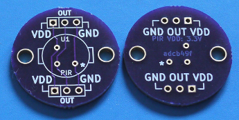

# Panasonic PIR breakout board

This is a Panasonic PIR breakout board. It breaks out the sensor onto 0.1"/2.54mm pitch headers, for use with a solderless breadboard. This breakout is still in development -- while it is usable at the moment, work needs to be done to perfect a few minor issues.

Here is what it looks like currently:
 

This board has been verified using the following PIR sensor(s):

* EKMB1303112 - [Mouser](http://www.mouser.com/Search/Refine.aspx?Keyword=EKMB1303112)
* EKMC1601111 - [Digikey](http://www.digikey.com/product-search/en?WT.z_header=search_go&lang=en&site=us&keywords=EKMC1601111) (The pinout is simliar to the EKMB1303112, but the pins seem a bit closer together. Fits fairly well slightly stretched apart).

## Board notes

* The \* on the front and back of the board denote the ground pin of the sensor. On the EKMB1303112, this is indicated by a filled-in gold area around the pin.

## Licensing

CC0 1.0 Universal (the LICENSE file has more details)
