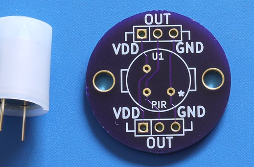
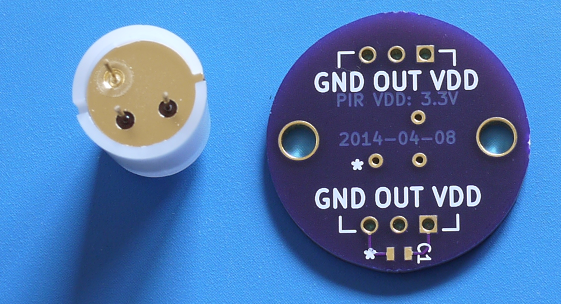

# Panasonic PIR breakout board

This is a Panasonic PIR breakout board. It breaks out their TO-5 sensors onto 0.1"/2.54mm pitch headers, for use with a solderless breadboard.

Here is what it looks like currently:

Top (alongside the EKMC1601111):

Rear (note the filled in gold area on one pin of the PIR, it goes with the \* on the board and denotes ground):

## Board notes

* The \* on the front and back of the board denote the ground pin of the sensor. On the EKMB1303112 and EKMC1601111, this is indicated by a filled-in gold area around the pin.

## Fabrication

The simplest way is to just [click through to this shared project on OSHPark's site](http://oshpark.com/shared_projects/VIIMKRcy). You'll get three boards with purple soldermask.

If you prefer using your own CNC/mill/board house, just grab the Gerber files and KiCAD source and bobs (nearly) your uncle. If you really are going to use a CNC/mill/etch, it might be ideal to drop a polygon fill on both sides to minimize the amount of copper that needs to be removed.

### Bill of Materials

Pick a sensor (these have been verified to fit on this breakout):

| Model       | Vendor |
| ----------- | ------ |
| EKMB1303112 | [Mouser](http://www.mouser.com/Search/Refine.aspx?Keyword=EKMB1303112) |
| EKMC1601111 | [Digikey](http://www.digikey.com/product-search/en?WT.z_header=search_go&lang=en&site=us&keywords=EKMC1601111) |

You'll also need a strip of 0.1"/2.54mm header, but this is optional (since you may use wire to permanently 
install the breakout later).

| Quantity | Description/Vendor |
| -------- | ------------------ |
| 1        | 36-pin header: [Mouser: 649-68004-236](http://www.mouser.com/Search/Refine.aspx?Keyword=649-68004-236) / Alternative (3-pin, untested!): [Mouser: 571-1031853](http://www.mouser.com/Search/Refine.aspx?Keyword=571-1031853) |

## Licensing

CC0 1.0 Universal (the LICENSE file has more details)
